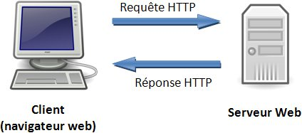

# API

### Définition

> API pour **Application Programming Interface**, en français : **interface de programmation applicative**.
  L'API est une solution informatique qui permet à des applications de communiquer entre elles 
  et de s'échanger mutuellement des données.
  
Exemple d'API publiques que vous pouvez intégrer dans vos projets pour compléter vos données ou fonctionnalités : 
- [API Facebook](https://developers.facebook.com/), "Facebook connect" par exemple 
- [API Twitter](https://developer.twitter.com/en/docs)
- [Google Maps](https://developers.google.com/maps/?hl=fr), [Google Connect](https://developers.google.com/identity/choose-auth) 
- [Instagram](https://www.instagram.com/developer/) (infos sur l'utilisateur, listes de photos...)
- [API Paypal](https://developer.paypal.com/), pour ajouter un système paiement
- [Weather Underground](https://www.wunderground.com/weather/api/)

En vrai, à quoi ça ressemble ? 

Si vous allez sur l'[explorateur d'API Facebook](https://developers.facebook.com/tools/explorer/), vous pouvez tester leur API.
Cliquez sur 'Obtenir le token', ajoutez des champs puis appuyez sur envoyer.

On vient d'envoyer une requête à l'API Facebook.
- https://graph.facebook.com/ - est l'URL de base de l'API
- /v2.10/ - version de l'API utilisée
- /me - fonctionnalité requêtée, ici toutes les informations liées à l'utilisateur connecté
- ?fields=id,name,address,about,email,education,birthday,age_range,cover,currency - options de la requête

Le résultat : un fichier JSON avec les données brutes demandées

Response body
```json
{
  "id": "1169172154",
  "name": "Alexandre Peyron",
  "birthday": "02/20/1989",
  "age_range": {
    "min": 21
  },
  "cover": {
    "id": "10209396912337634",
    "offset_x": 0,
    "offset_y": 68,
    "source": "https://scontent.xx.fbcdn.net/v/t31.0-8/s720x720/13323616_10209396912337634_1782169267946129260_o.jpg?oh=3a53b9afb2762cb97a0447d4d30569e6&oe=5A72C8F1"
  },
  "currency": {
    "currency_offset": 100,
    "usd_exchange": 1.1540209,
    "usd_exchange_inverse": 0.8665354328,
    "user_currency": "EUR"
  },
  "locale": "fr_FR",
  "hometown": {
    "id": "109422405749825",
    "name": "Arsac-en-Velay"
  }
}
```

### Le protocole HTTP

> L'acronyme HTTP signifie Hypertext Transfer Protocol (traduction: protocole de transfert hypertexte). 
Ce protocole définie la communication entre un client (exemple: navigateur) et un serveur sur le World Wide Web (WWW).



Concrètement, qu'est-ce qu'il vient de se passer ?

On a envoyé une requête à l'API Facebook, via le protocole HTTP, 
les serveurs FB ont traité la requête pour ensuite nous renvoyer les informations souhaitées.

Physiquement notre requête ressemble à ça :

Request Header
```bash
:authority: graph.facebook.com
:method: GET
:path: /v2.10/me?fields=id%2Cname%2Caddress%2Cabout%2Cemail%2Ceducation%2Cbirthday%2Cage_range%2Ccover%2Ccurrency&format=json&method=get
:scheme: https
accept: */*
accept-encoding: gzip, deflate, br
cache-control: no-cache
content-type: application/x-www-form-urlencoded
referer: https://developers.facebook.com/
user-agent: Mozilla/5.0 (Macintosh; Intel Mac OS X 10_12_6) AppleWebKit/537.36 (KHTML, like Gecko) Chrome/61.0.3163.100 Safari/537.36
```
Request Body
```text
Vide dans notre cas
```


Les éléments importants ici sont :
- La méthode : GET, signifie qu'on veut récupérer des informations sur le serveur
- path :  indique quelle fonctionnalité de l'API on requête
- referer : site d'où provient la requête
- user-agent


Response Header
```bash
access-control-allow-origin: *
content-encoding: gzip
content-length: 355
content-type: application/json; charset=UTF-8
date: Sun, 05 Nov 2017 17:50:31 GMT
expires: Sat, 01 Jan 2000 00:00:00 GMT
facebook-api-version: v2.10
pragma: no-cache
status: 200
```
Response Body
```
Il s'agit du JSON précédemment affiché
```

Les éléments importants : 
- access-control-allow-origin : * signifie que tous les referer sont autorisés à appeler l'API
- content-type : l'API nous renvoie bien du JSON
- status : 200 OK, tout s'est bien passé
- body : il contient les informations qu'on a demandé


#### Les méthodes HTTP

Voici toutes les actions de bases qu'on peut effectuer sur une ressource : 

- GET - Pour récupérer des ressources. Soit le détail d'une seule, soit une liste.
- POST - Pour créer une nouvelle ressources.
- PUT/PATCH - Mettre à jour une ressource.
- DELETE - Supprimer une ressource.

C'est ce qu'on appelle le CRUD (Create Read Update Delete).


#### Les codes 

* Les codes en 2XX indiquent que tout s'est bien passé.
  * 200 OK
  * 201 CREATED

* Ceux en 3XX indiquent une redirection, cas qu'on verra rarement dans le cadre d'une API

* Les codes en 4XX affichent une erreur côté client
  * 400 Bad Request, la requête est fausse
  * 401 Unauthorized, l'utilisateur doit être authentifié 
  * 403 Fordidden, l'utilisateur est authentifié mais n'a pas le droit d'utiliser cette fonctionnalité
  * 404 Not Found, la plus connue, ressource introuvable

* Les codes en 5XX, une erreur coté serveur
  * 500 Internal Server Error
  * 504 Gateway Time-out, le script côté serveur est trop long à traiter

Bonus
- 418 I'm a teapot

Le détail [sur Wikipédia](https://fr.wikipedia.org/wiki/Liste_des_codes_HTTP)


### Développer sa propre API

Utiliser des API externes c'est top ! Mais parfois (souvent) (de plus en plus) on a besoin de développer ses propres API.

Pourquoi ?

Avec l'augmentation des projets multi supports (web app, mobile, app desktop), on a besoin de centraliser nos données
pour que chaque application travaille sur la même base. C'est ici le rôle de l'API.

Un dessin vaut mieux qu'on long discours.


#### Les types d'API

- SOAP (Simple Object Access Protocol)
  
  L'un des premiers système d'API normalisé. Développé initialement par Microsoft et IBM, il est basé sur l'envoi et la réception de XML.
  Principal inconvénient : le XML !
  Celui-ci alourdi considérablement les échanges client/serveur.

- API REST (Representational State Transfer)

Architecture d'API la plus utilisée aujourd'hui. C'est celle qu'on va voir plus en détails dans le suite du cours.

- GraphQL

Alternative montante aux API REST, développé par Facebook.


#### Structure d'une API REST
L'API REST est orienté ressources. Cela signifie que la combinaison d'une méthode HTTP et d'une URL vont effectuer une action spécifique sur une ressource.

Prenons l'exemple d'une base de données contenant une table Article (article de blog, title, contenu, date de création...).

On va structurer notre API REST de cette manière.

```bash
GET /articles  #renvoie un tableau JSON avec la liste des articles
```

```bash
GET /articles/{id}  #renvoie toutes les informations d'un article, celui associé à l'ID
```

```bash
POST /articles  #crée un nouvel article en fonction des données envoyées dans le body de la requête
```

```bash
PUT /articles/{id}  #met à jour un article existant, celui associé à l'ID
```

```bash
DELETE /articles/{id}  #supprime l'article
```


